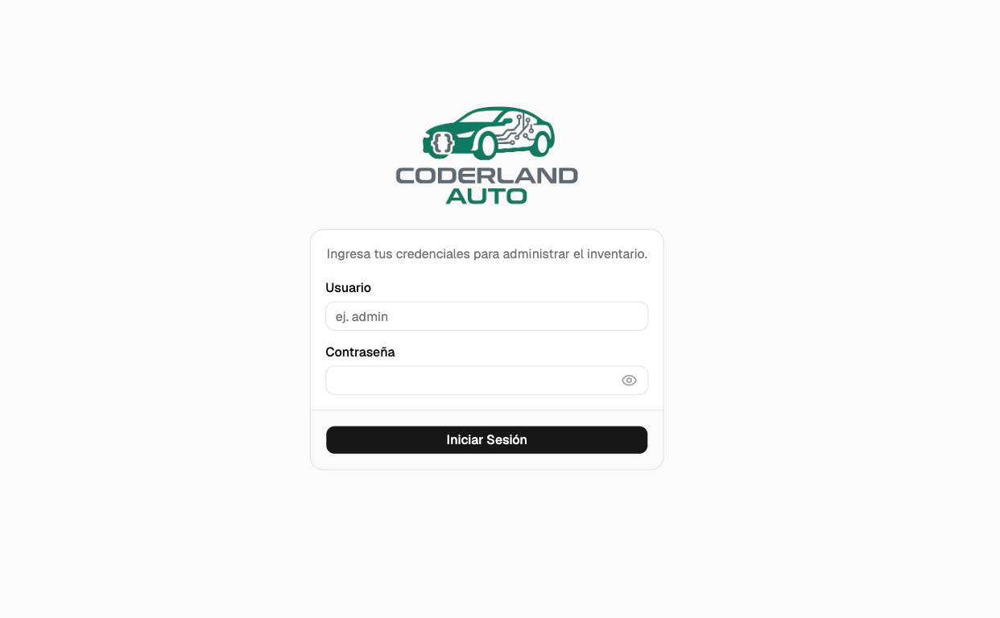
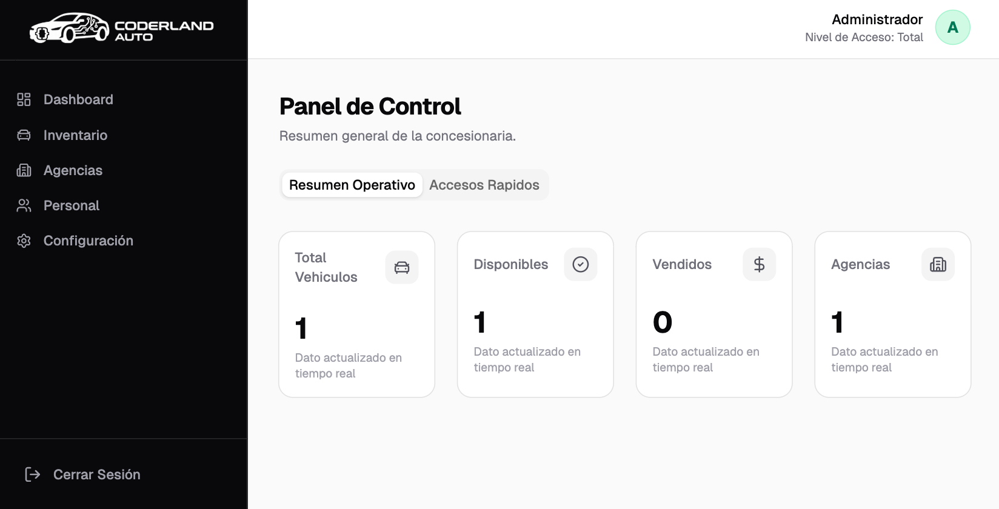
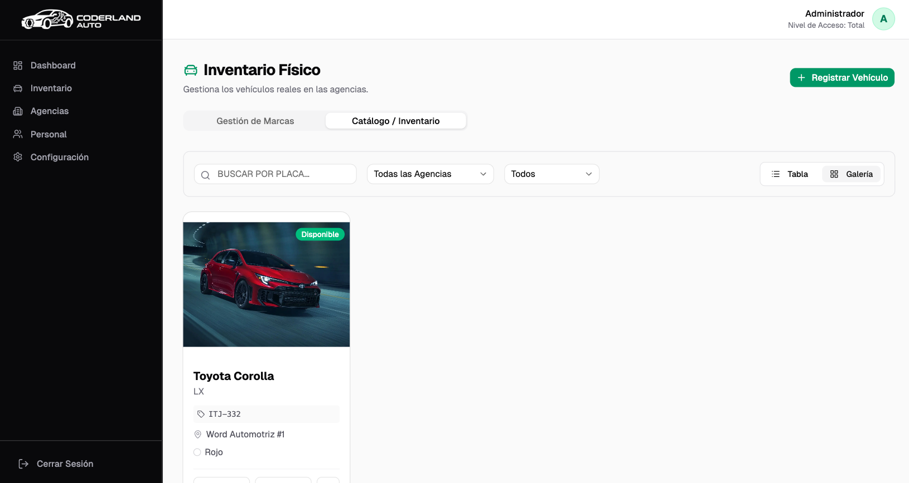
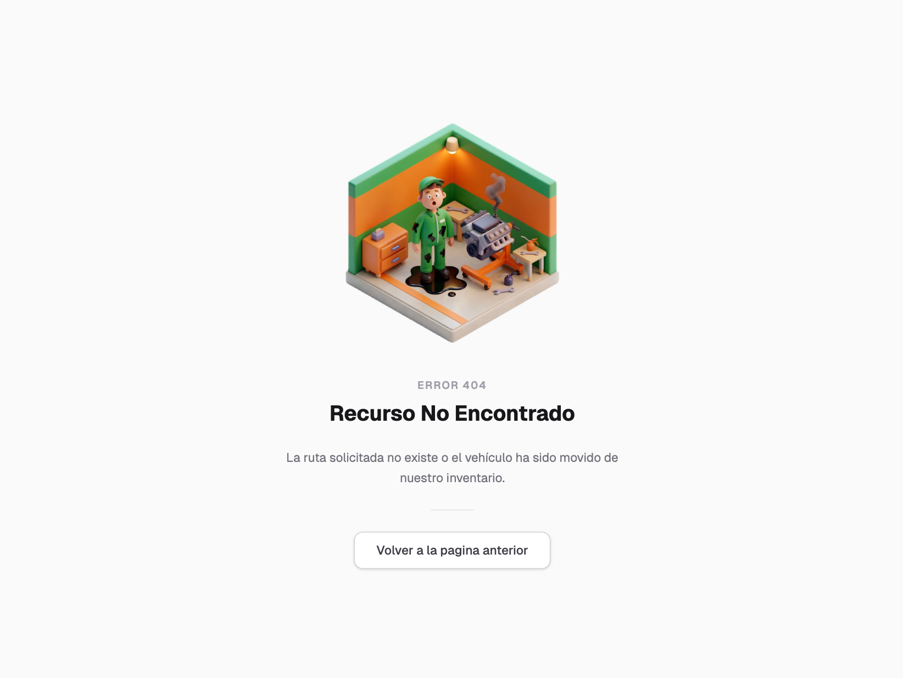

<div align="center">
  <h1>Coderland Auto - Sistema de Gestión de Inventario Automotriz</h1>

  [](#)
  [](#)
  [](#)
  [](#)
  [](#)
  [](#)

  <p>Repositorio entregable que contiene la solución íntegra al reto técnico de Coderland. Un análisis exhaustivo sobre la arquitectura, calidad y resiliencia de la ingeniería aplicada.</p>
</div>

---

## Propósito de la Prueba Técnica

Este proyecto conforma la resolución metodológica para la prueba técnica avanzada solicitada por **Coderland**. El sistema, titulado `Coderland Auto`, modela un caso de uso ficticio enfocado en satisfacer los rigurosos estándares de una gestión de inventario automotriz empresarial. 

El repositorio fue estructurado con un propósito delineado: demostrar competencias reales en la orquestación de APIs RESTful contemporáneas, diseño sistemático de interfaces SPA, aislamiento de recursos a través de contenedores y, por sobre todo, enfatizar en las decisiones arquitectónicas de mantenibilidad esperadas por los evaluadores técnicos y líderes de desarrollo de Coderland.

## Arquitectura y Decisiones Técnicas

El proyecto está diseñado bajo un modelo cliente-servidor estrictamente separado, permitiendo la escalabilidad independiente de las capas.

### Arquitectura Frontend

La capa de presentación web ha sido desarrollada utilizando:

- **React**: Como biblioteca principal para la construcción de interfaces dinámicas.
- **Shadcn UI y Tailwind CSS**: Para la creación de componentes accesibles y estables, garantizando coherencia visual mediante clases de utilidad sin depender de estilos precompilados rígidos.
- **Context API**: Implementado para la gestión del estado global de la autenticación y el manejo global de errores.
- **Axios con Interceptors**: Configurado para la inyección automática de tokens de seguridad y la interceptación centralizada de respuestas de error de red o no autorizadas.

### Arquitectura Backend

La lógica de negocio y persistencia se gestiona a través de:

- **Spring Boot 4**: Framework base para la creación de la API REST.
- **Spring Data JPA e Hibernate**: Para la abstracción de acceso a datos y mapeo objeto-relacional (ORM).
- **PostgreSQL**: Motor de base de datos relacional primario.
- **Arquitectura por Capas**: Clara separación entre Controladores, Servicios y Repositorios, garantizando la mantenibilidad y aislamiento de la lógica de negocio.
- **Data Transfer Objects (DTOs)**: Implementados para asegurar que la exposición de datos hacia el frontend esté controlada y sea independiente de los modelos de persistencia.

### Decisiones Clave

- **Optimización Multimedia (WebP)**: Para el almacenamiento de imágenes, se optó por compresión y formato WebP, lo cual reduce significativamente el consumo de ancho de banda y los tiempos de carga en las galerías visuales.
- **Paginación Server-Side (Inventario)**: Con el objetivo de gestionar eficientemente volúmenes de datos a gran escala, el módulo de inventario procesa la paginación a nivel de base de datos. Esto previene la sobrecarga de memoria en la aplicación cliente enviando únicamente los bloques de datos necesarios.
- **Soft-fallbacks Visuales**: Se han implementado respaldos visuales automáticos para registros que carecen de imágenes específicas, manteniendo la integridad de la interfaz general sin generar fracturas de diseño.

## Resolución de Criterios Técnicos

A continuación se detalla técnicamente la resolución de las áreas solicitadas durante el proyecto:

- **Dockerización Avanzada**: La infraestructura orquestada por `docker-compose.yml` emplea redes en modo `bridge` para el aislamiento de los contenedores web y base de datos. Asimismo, define e implementa volúmenes persistentes explícitos para la base de datos (`postgres_data`) y los recursos multimedia cargados localmente (`/uploads`).
- **Documentación de API**: Se ha integrado OpenAPI para explorar de forma interactiva cada endpoint. La interfaz de documentación, generada a través de Scalar UI, se encuentra accesible de manera directa en la ruta `/scalar` sin requerir configuraciones adicionales tras levantar los contenedores.
- **Seguridad**: Implementación formal de Spring Security construyendo filtros personalizados que procesan tokens JWT (firmados digitalmente bajo el estándar HS256). Toda la comunicación está estructurada bajo el enfoque Stateless, omitiendo el control de sesiones en la memoria del servidor.
- **Validaciones**: Se implementó una gestión de errores transversal a través de `@ControllerAdvice`, centralizando la captura de excepciones (como la violación de constraints de base de datos). Estos errores se propagan como instrucciones estructuradas bajo los códigos HTTP 400 y 409, los cuales son posteriormente capturados por el Frontend y presentados informativamente en los inputs o modales correspondientes.
- **UX/UI en Frontend**: La plataforma opera como una Single Page Application (SPA) responsiva con un diseño basado en la paleta de colores Zinc y Emerald. Incorpora transiciones de estado en la navegación y prevé vistas exclusivas en el esquema de ruteo para aislar los errores críticos u omisiones de permisos (404, 403 y 500).

## Instrucciones de Despliegue (Docker)

La infraestructura local (Persistencia de PostgreSQL, Servomotor de API y renderizado del cliente) ha sido íntegramente contenedorizada. Se aprovisionaron redes internas para gobernar el enrutamiento restringido y volúmenes permanentes para blindar las migraciones de bases de datos (`postgres_data`) y los assets de imágenes (`/uploads`).

El ecosistema entero se levanta de manera silenciosa invocando una única orquestación de CLI:

```bash
git clone https://github.com/notSoEliel/automotriz-project-coderland.git
cd automotriz-project-coderland
docker-compose up -d
```

## Exploración de la API Interactiva

Una vez levantado el entorno con Docker, el servidor expone su documentación OpenAPI (Scalar UI):

- **Panel de control Swagger/Scalar:** `http://localhost:8080/scalar` (Accesible redireccionando desde la raíz del backend `/`).

### Tabla de Endpoints Principales

| Endpoint | Método HTTP | Descripción del Servicio |
| :--- | :---: | :--- |
| `/api/auth/login` | `POST` | Interfaz de autenticación general. Consume credenciales y emite el *JWT Stateless Token*. |
| `/api/vehiculos` | `GET` | Recuperación del catálogo general implementando *Server-Side Pagination* algorítmica. |
| `/api/vehiculos/{id}` | `GET` | Visualización en profundidad del ecosistema adjunto de una unidad particular. |
| `/api/marcas` | `GET` | Retorno masivo o filtrado de marcas y representaciones constructoras. |

## Pantallas del Frontend

La arquitectura en React opera como una Single Page Application, fraccionando la distribución informativa mediante los siguientes ejes visuales:

| Nombre de Vista | Propósito de la Capa |
| :--- | :--- |
| **Login** | Punto de restricción principal y anclaje inicial para inyectar validaciones *JWT Stateless Token* sobre las cabeceras Axios. |
| **Dashboard** | Pantalla principal de bienvenida y visuales agregados, demostrando KPIs genéricos. |
| **Agencias** | Módulo de gestión y visualización de sedes o puntos de venta vinculados a la red automotriz. |
| **Inventario** | Núcleo grueso del proyecto. Interfaz robusta que orquesta los filtros al servidor, manipula paginación algorítmica externa, y abstrae el control de imágenes y galerías WebP. |
| **Error Views** | Vistas de contingencia estilizadas (404, 403, 500) que capturan estados de navegación inválidos o fallos críticos, manteniendo la integridad de la experiencia de usuario. |

## Aseguramiento de Calidad (Testing Suite)

La arquitectura profunda está revestida defensivamente mediante una suite automatizada configurada con **JUnit 5**, mitigación de inyecciones externas vía **Mockito**, y un parseo nativo asegurado contra el entorno de Spring 7 invocando el estándar estricto de **Jackson 3** (`tools.jackson`). 

A fin de garantizar resultados ininterrumpidos y agilidad metodológica, estas aserciones se iteran y aislan en tiempo de compilación frente a la base de datos externa. 

### Cobertura Estricta de la Suite

| Vector Auditado | Mecanismos de la Prueba de Contención (Ejemplos) |
| :--- | :--- |
| **Integridad y Validación** | Comprobación de integridad DTO. Rechazo de estructuras que incurran en precios negativos. |
| **Paginación y Bloques** | Solidez algorítmica exigiendo recortes (arrays sub-cero) y manejo de índices fuera de límites (*Out of Bounds* limits). |
| **Restricciones de Seguridad** | Blindaje contra escalada de privilegios y accesos no autorizados (`HTTP 401/403`). Bloqueo heurístico para interceptar la subida o inserción de ejecutables y/o archivos maliciosos frente a las galerías nativas WebP. |
| **Integridad Referencial** | Restricciones de borrado estructural en cascada desde la base de datos de origen `JPA` (e.g. evitar categóricamente el borrado de marcas primarias que alojan catálogos activos de modelos asociados a ellas). |

Puede disparar e invocar la capa de compilación estricta utilizando Docker para garantizar el aislamiento (sin requerir Java 25 localmente):

```bash
# Ejecución aislada a través del Wrapper y contenedor oficial

#Ejecutar desde la raíz del proyecto
docker run --rm -v "$PWD/backend":/app -w /app maven:3-eclipse-temurin-25 mvn clean test
```

## Estructura Analítica de Directorios

```text
automotriz-project-coderland/
├── backend/                   # API REST en Spring Boot 4.0.3, Java 25
│   ├── src/test/java/...      # Aserciones de Aseguramiento de Calidad (JUnit 5 + Mockito)
│   ├── src/main/java/...      # Inyecciones (Auth JWT, @ControllerAdvice, Services)
│   └── src/main/resources/    # Estructuras de bases de datos relacionales persistentes
├── frontend/                  # React 19 SPA + UI Zinc/Emerald Modular
│   ├── src/                   # Capas de interceptores (Axios), Routing y Paginadores
├── docker-compose.yml         # Reglas directivas de contenedores, redes y volúmenes persistentes
└── README.md                  # Especificación Arquitectónica (Actual)
```

## Capturas de Interfaz









---
*Desarrollado y estructurado metodológicamente como una demostración de ingeniería de software avanzada para Coderland. 2026.*
